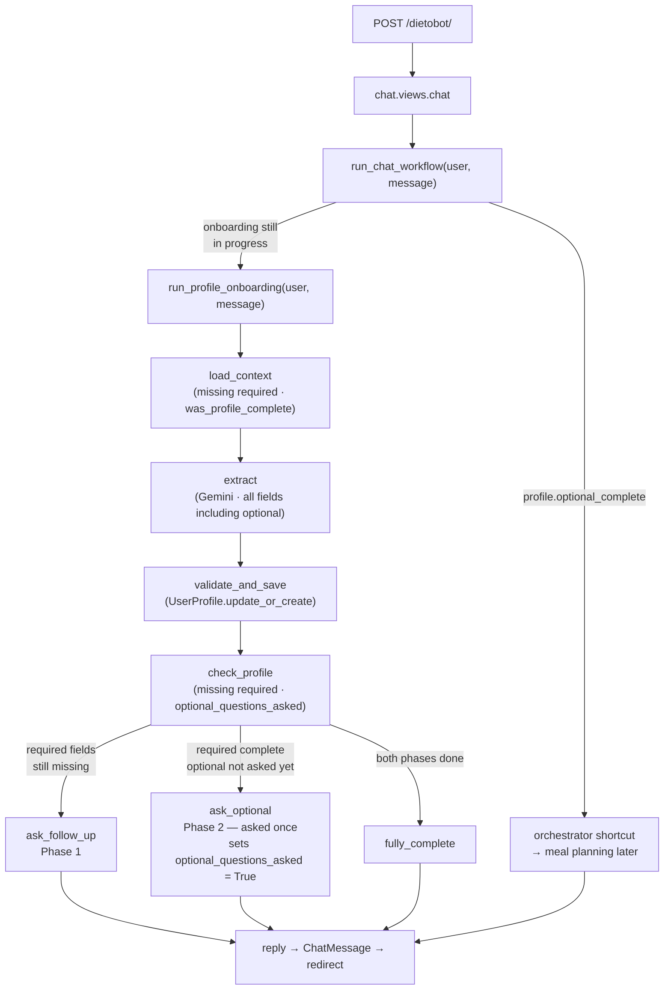

## Data flow

### Model properties

| Property | Derived from |
|---|---|
| `profile_complete` | all 6 required fields non-null |
| `optional_complete` | `profile_complete and optional_questions_asked` |

`optional_questions_asked` is a `BooleanField` — it records the *event* of the prompt being sent, which cannot be derived from field values alone (a user might volunteer allergy info in Phase 1, which would flip a field-value property too early).
