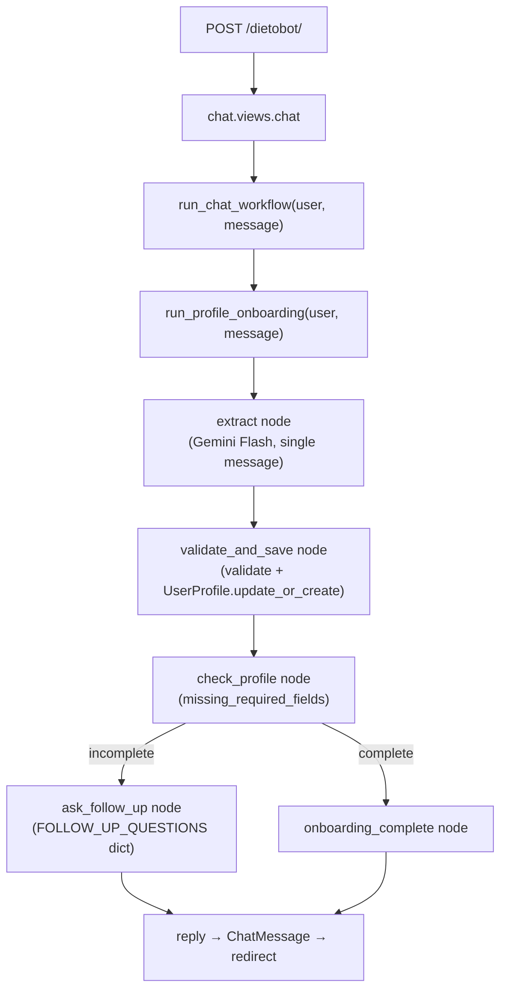

## Data flow after the change

```mermaid
flowchart TD
    A["POST /dietobot/"] --> B["chat.views.chat"]
    B --> C["run_chat_workflow(user, message)"]
    C --> D["run_profile_onboarding(user, message)"]
    D --> E["extract node\n(Gemini Flash, single message)"]
    E --> F["validate_and_save node\n(validate + UserProfile.update_or_create)"]
    F --> G["check_profile node\n(missing_required_fields)"]
    G -->|incomplete| H["ask_follow_up node\n(FOLLOW_UP_QUESTIONS dict)"]
    G -->|complete| I["onboarding_complete node"]
    H --> J["reply → ChatMessage → redirect"]
    I --> J
```