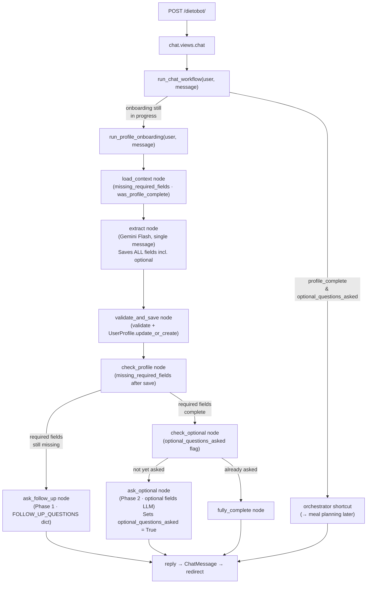

## Data flow after the change



### Phase summary

| Phase | Trigger | Fields covered | Node |
|-------|---------|---------------|------|
| **1 – Required** | Every turn until complete | age, sex, height_cm, weight_kg, activity_level, goal | `ask_follow_up` |
| **2 – Optional** | Once, right after Phase 1 finishes | meals_per_day, max_cooking_minutes, foods_disliked, dietary_preferences, allergies, weekly_budget | `ask_optional` |
| **Done** | After Phase 2 prompt was sent | — | `fully_complete` / orchestrator shortcut |

> **Key property**: extraction runs and saves *all* fields (including optional) on *every* turn,
> so any info the user volunteers early is never lost — only the *questioning* of optional fields
> is deferred to Phase 2.
```
